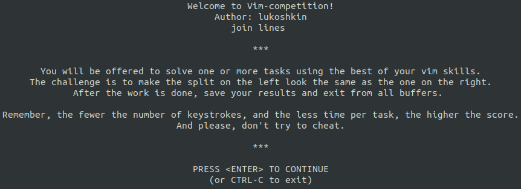
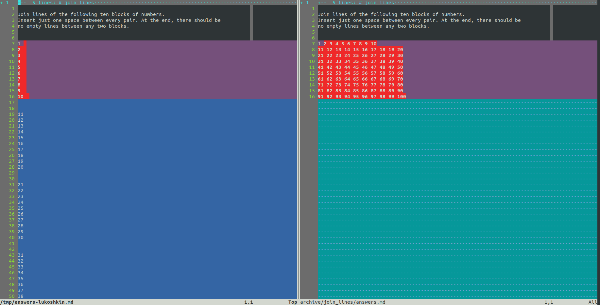
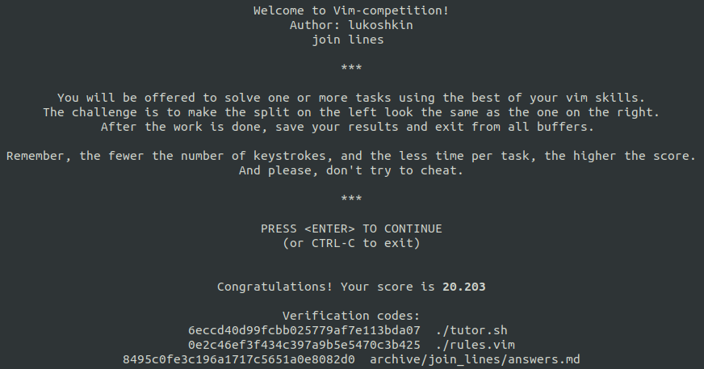

# Vim-tutor

Learn Vim by competing with others!

## Usage

* To start the "join lines" competition from the project folder:

  ```bash
  ./tutor.sh compete archive/join_lines
  ```

  Which opens `join_lines/tasks.md` and `join_lines/answers.md` in Vim diff mode,
  after showing a preamble. You can quickly toggle the highlighting of diverging
  lines with `do` mapping in normal mode. However, when it is on, you hardly
  leave the competition prematurely if not intentionally. After saving the
  results and closing Vim, the score appears on the screen.





---

* Take up creating your own challenge with a stencil:

  ```bash
  ./tutor.sh stencil -a lukoshkin -p fancy_name archive/fancy_name
  ```

  This creates a proper folder structure of files you need to fill. The
  specified options above add entries about the author and the problem name to
  `tasks.md` file (as well as to `answers.md` and README.md). Anytime a user
  starts your competition, they will appear in its preamble.

  One can overwrite "global" rules with their own by creating `rules.vim` file
  in the directory with the problem. In stencil this is taken into account by
  appending `-r` or `--rules` option.

## Scoring

Currently, the score is calculated using the formula:


## TODO list

- [x] Scoring system
- [ ] More detailed README
- [ ] bash/zsh completions
- [ ] Leaderboard
- [ ] Useful tips
